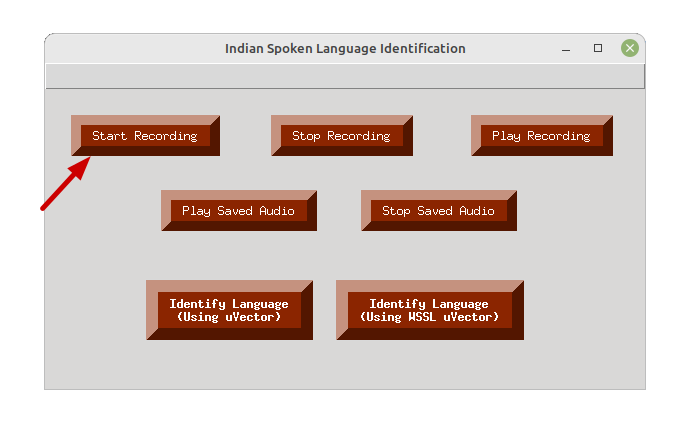
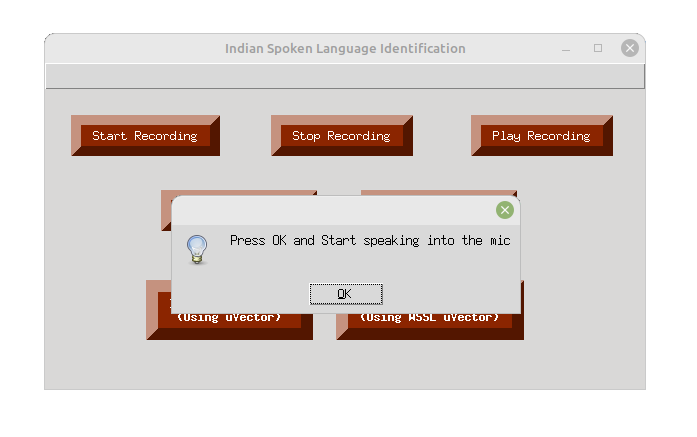

# Spoken Language Identification GUI

This Python script implements a graphical user interface (GUI) for Spoken Language Identification using uVector and uVector with WSSSL models. The GUI allows users to perform various tasks such as recording audio, playing saved audio files, and identifying the language of spoken audio using both standard uVector and WSSL uVector models.

## Prerequisites

#### Make sure you have the following libraries installed:

- pandas==1.3.4
- sounddevice==0.4.5
- soundfile==0.10.3
- pygame==2.1.2
- torch==1.11.0
- matplotlib==3.4.3

#### The list of imported libraries

- tkinter
- pygame
- matplotlib
- datetime
- shutil
- random
- os

#### You can install these libraries using the following command:

```bash
pip install pandas==1.3.4 sounddevice==0.4.5 soundfile==0.10.3 pygame==2.1.2 torch==1.11.0 matplotlib==3.4.3
```
Or,

```bash
pip install -r requirements.txt
```

## Usage

#### 1. Clone the repository:

```bash
git clone https://github.com/NLTM-LID/LID.git
cd LID/GUI
```

#### 2. Make sure the following directories and Python files are present.
- BUT: It contains the codes and pretrained model used for extracting the bottleneck features (BNF).
- classified_audio: It keeps the correctly classified audio files based on the user feedback.
- unclassified_audio: It keeps the wrongly classified audio files based on the user feedback.
- recorded_audio: It stores the current recorded audio.
- extracted_BNF: Stores the extracted bottleneck features (BNF) of the audio file.
- model: Contains the pretrained models.
- demo_uvector.py: Code for the uVector
- demo_uvector_wssl.py: Code for the uVector with WSSL
- extract.py: Calling the python script to extract the BNF features
- sound.py: Contains the code for audio recording features.
- gui.py: It's the main code for GUI.

#### 3. Run the script:

```bash
python gui.py
```

The GUI window will appear, providing options for recording audio, playing saved audio, and identifying the language using uVector and WSSL uVector models.

## Features

#### 1. Language identification of recorded speech audio: 
To perform this task, we have the following functions in the GUI.

##### Start Recording

<p float="left">
  
   
  
</p>

[](img/Recording_start.png  "srec")
 

- **Stop Recording**: Stops the ongoing audio recording.

- **Play Recording**: Plays the recorded audio.

- **Play Saved Audio**: Select and play a saved audio file.

- **Stop Saved Audio**: Stops the currently playing saved audio.

- **Identify Language (Using uVector)**: Identifies the language of the selected audio using standard uVector models.

- **Identify Language (Using WSSL uVector)**: Identifies the language of the selected audio using WSSL uVector models.


## Results and Confirmation

- After language identification, the predicted language is displayed, and a confirmation message box appears. The user can confirm or deny the predicted language.
- If confirmed, the audio file is moved to the corresponding language directory under `classified_audio` directory with a timestamped filename.
- If denied, the audio file is also moved to the `unclassified_audio` directory with a different timestamped filename.

## Additional Information

- The GUI uses pygame for audio playback and matplotlib for displaying language identification probabilities.
- The uVector and WSSL uVector models are loaded from the `demo_uvector` and `demo_uvector_wssl` modules.
- The `sound` module handles audio recording functionalities.

## References

- H. Muralikrishna, P. Sapra, A. Jain and D. A. Dinesh, "Spoken Language Identification Using Bidirectional LSTM Based LID Sequential Senones," 2019 IEEE Automatic Speech Recognition and Understanding Workshop (ASRU), Singapore, 2019, pp. 320-326, doi: 10.1109/ASRU46091.2019.9003947.(https://ieeexplore.ieee.org/document/9003947)
- M. H, S. Kapoor, D. A. Dinesh and P. Rajan, "Spoken Language Identification in Unseen Target Domain Using Within-Sample Similarity Loss," ICASSP 2021 - 2021 IEEE International Conference on Acoustics, Speech and Signal Processing (ICASSP), Toronto, ON, Canada, 2021, pp. 7223-7227, doi: 10.1109/ICASSP39728.2021.9414090.(https://ieeexplore.ieee.org/document/9414090)

## License

This project is licensed under the NLTM License - see the [LICENSE](LICENSE) file for details.
